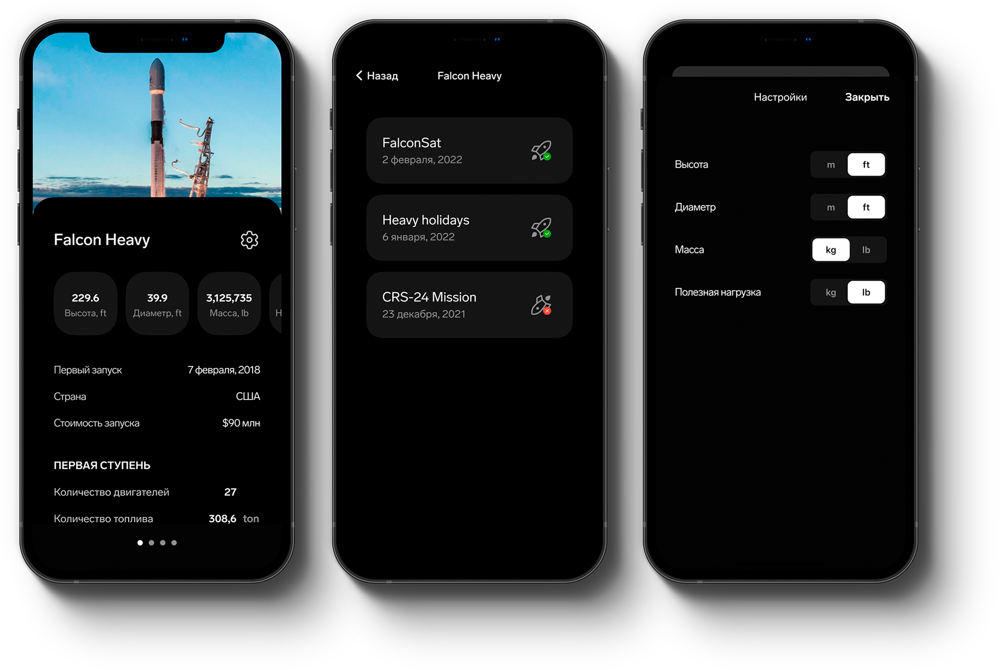

<p align="center">

</p>

# SpaceX rockets & launches iOS app

Тестовое задание iOS разработчика

## Стартовый экран приложения.

Данные для приложения загружаются по API через URLSession
[Rockets](https://api.spacexdata.com/v4/rockets)
[Launches](https://api.spacexdata.com/v4/launches)


Так как космических ракет несколько, в качестве навигации между ними используется элемент Page Control.
В верхней части экрана располагается случайное изображение космической ракеты и ее наименование.
Далее идет блок горизонтальной информации с указанием названия параметра, значения и единицы измерения:

- высота ракеты
- диаметр
- масса
- полезная нагрузка для id «leo» (низкой околоземной орбиты)

Затем отображается вертикально следующая информация:

- дата первого запуска
- страна
- стоимость запуска
- первая ступень - количество двигателей
- первая ступень - количество топлива в тоннах
- первая ступень - время сгорания в секундах
- вторая ступень - количество двигателей
- вторая ступень - количество топлива в тоннах
- вторая ступень - время сгорания в секундах

В нижней части экрана показывается кнопка «Посмотреть запуски», при нажатии на данную кнопку происходит переход на экран 2.





<!-- TODO -->

## Есть идеи или предложения?

Нашли баг или есть предложения по функционалу? Feel free to [open a new issue](https://github.com/ruslan-gromov/RocketApp/issues).


## ToDo list:

Разработка первого экрана приложения

```
...

```

